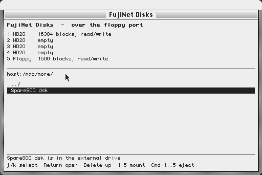
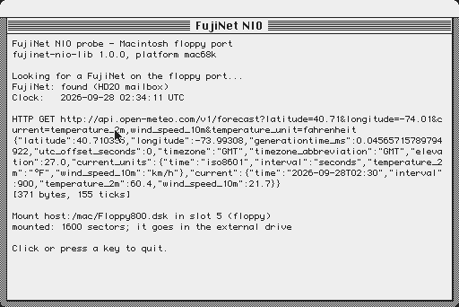
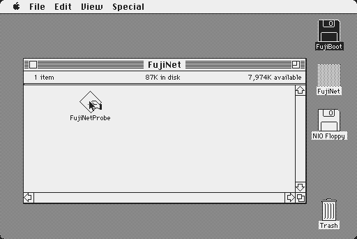

# FujiNet NIO on the classic Macintosh (floppy port)

**Architecture in full, including the first real-Mac boot: [NIO-ARCH.md](NIO-ARCH.md).**

**FujiNet CONFIG as a desk accessory on NIO: [apps/fnconfig](apps/fnconfig/README.md).**

fujinet-nio serving a 68000 Mac through its **floppy port**, as the FujiNet
Mac firmware does:

* HD20 (DCD) disks;
* the 800K GCR floppy.

It adds something no firmware had: **FujiBus commands from Mac programs,
carried over the IWM**.

Verified in the Snow emulator, as a Mac Plus (ROM v3) running System 6.0.8:

* NIO's `FujiNet.hda` mounts on the desktop as an HD20 with the FujiNet icon.
* The Finder opens it, and runs an application from it.
* The Finder duplicates a 400 KB file on it. The copy is byte-identical: that
  exercises 800 blocks of HD20 reads and writes.
* **FujiNetProbe**, a Mac app built on fujinet-nio-lib, finds the FujiNet and
  reads its clock. It then has the FujiNet make an HTTP GET (live weather,
  371 bytes). Every call is a FujiBus packet through the floppy port.
* The probe then **mounts a floppy image** into NIO's floppy slot, again
  over the floppy port. NIO GCR-encodes it with the FujiNet Mac firmware's
  encoder, and **"NIO Floppy" appears in the external drive**.
* The Finder duplicates an application on that floppy. Its writes go back as
  GCR tracks, and NIO decodes them into the `.dsk` (116 sectors). The copy's
  resource data is identical: only the name the Finder stamps into the fork
  header differs.
* A Mac eject tells NIO, which unmounts the slot and forgets it, as the
  firmware does.
* **A Mac Plus with no floppy boots System 6.0.8 from NIO's HD20**
  (`BOOT_FROM=run/boot608.dsk tools/make-fujinet-volume.sh`).
* **FujiNet Disks**, a Mac app, is a small CONFIG over the floppy port. It
  browses NIO's `host:/mac/` through the FileService and shows the five
  slots. It mounts the selected image with 1-5 and ejects with Command-1..5.
  A floppy mounted in slot 5 is in the external drive at once; the HD20
  slots take effect when the Mac restarts, since the ROM looks for HD20s
  only at startup.



NIO unit tests (`tests/test_mac_floppy_framer.cpp`, in patch 0006) cover:
DCD status and block I/O, a two-block mailbox exchange, floppy tracks
(encode, round trip, a rewritten sector decoded into the image, step,
motor, eject), and polled mode. The full suite passes: 387 of 387.





## How it fits together

```
Mac (68000, ROM HD20 driver in .Sony)          real hardware: DB-19 floppy port
   |  IWM: DCD phases, !HSHK, 7-to-8 groups     -> FujiNet Mac board's Pico
   v
Snow  core/src/mac/swim/dcd.rs                  plays the Pico's part
   |  Pico <-> FujiNet protocol over TCP        -> on the board: 2 Mbaud UART
   v   ('A'..'D' select, 'R' read, 'W' write, 'T' status, 'h' units)
fujinet-nio  MacFloppyFramer                    (patch 0006)
   |-- HD20 blocks  -> DiskService (slot n = DCD unit n)
   |-- floppy       -> DiskService slot 5 (wire numbering), GCR codec
   `-- mailbox blocks -> FujiBus -> clock, network, disk, ... devices
```

### The floppy

NIO speaks the board's floppy commands:

* **From the drive side:** `0`/`4` step direction, `1` step (answered with the
  track), `2`/`6` motor on/off (`M`/`F`), `7` eject (`E`).
* **From NIO:** `s`/`d` inserted, `u`/`l` writable/locked, `r` removed.

`mac_gcr.{h,cpp}` is the FujiNet Mac firmware's encoder and decoder,
unchanged. On the board the ESP32 streams tracks from its RMT peripheral and
receives captured WR bitstreams. An emulator has neither wire, so it uses two
extra commands:

* `#` cyl side returns one encoded track.
* `P` cyl side bits sends back a whole written track. NIO finds every
  sector's address and data fields in it, including one written across the
  index, and writes only the sectors that changed.

Snow asks for all 160 tracks when a disk is inserted, and on motor-off sends
back only the tracks the Mac changed.

**Polled mode (`!`).** NIO's announcements are unsolicited, so one can land
in front of a reply the drive side is already waiting for. The board's Pico
avoids that by draining its UART before each command. An emulator on a
socket instead sends `!`: NIO then sends nothing unasked, and `?` answers
`h` n f (DCD units, floppy state). Snow polls `?` every 100 ms.

The drive side of the link is exactly what the Pico on the FujiNet Mac board
already speaks to the ESP32 (`fujinet-firmware lib/bus/mac/mac.h`). So the
same NIO framer should serve the real board, unchanged, once NIO runs on its
ESP32 with that UART as the channel.

### FujiBus over the floppy port: the mailbox

Every HD20 unit reports 16 more blocks than its image holds. Those blocks
never reach the image:

* **Write** blocks starting at the first of them: one raw FujiBus packet.
* **Read** them: the response.

```
block 0, bytes 0..15:  "FNIO"  version(1)  state  seq(u16)  length(u32)  reserved
                       state: 0 idle, 1 response ready, 2 request pending
bytes 16..             the packet, continuing into blocks 1..15 (8176 bytes max)
```

The Mac needs no driver, INIT or patch. A program finds the mailbox by
walking the drive queue and reading the block at `drive size - 16`, looking
for `FNIO`. It then does ordinary driver-level `PBWrite`/`PBRead` through
the ROM's HD20 support. The board's Pico needs no change either: to it these
are ordinary block reads and writes. The volume's own blocks are untouched,
so the unit is still a normal HFS disk.

marciot's `mac68k-fujinet-serial` pioneered data over DCD block I/O, using a
knock sequence and a magic file on the volume. The mailbox past the end of
the volume needs neither.

## Pieces

| Where | What |
| --- | --- |
| `patches/0006-fujinet-nio-mac-floppy-bus.patch` | NIO: `MacFloppyFramer`, profile `Mac68k`/`MacFloppy`, preset `mac-floppy-tcp-debug`, `.hda/.hfv/.dsk` as 512-byte-block images |
| `patches/0007-fujinet-nio-lib-mac68k.patch` | fujinet-nio-lib: `mac68k` target (Retro68), `src/platform/mac68k/fn_transport.c` |
| `patches/0008-fujinet-nio-stdio-read-write-switch.patch` | NIO: a write after a read on a stdio image file landed at the end of the read-ahead buffer (found copying files between two HD20s) |
| `patches/0009-fujinet-nio-mac-uart-unpaced.patch` | NIO: the Pico link is sent unpaced (the default pacing cost 64 ms per block) |
| `patches/0010-fujinet-nio-tnfs-block-cache.patch` | NIO: TNFS block cache with 8-block parallel read-ahead over extra handles |
| `patches/0011-fujinet-nio-mac-floppy-tracks-dc42.patch` | NIO: the floppy over the Pico's UART (tracks on request, `#` framed), DiskCopy 4.2 images |
| `mac/snow/*.patch` | Snow, also committed on branch `fujinet-dcd` of `~/code/snow`: (1) the DCD chain (`dcd.rs`) and `fnrun`, a scripted headless runner; (2) the FujiNet floppy in the external drive; (3) polled mode on the link |
| `mac/apps/fnprobe` | FujiNetProbe: clock, HTTP GET and a floppy mount through fujinet-nio-lib; a 56 KB Toolbox app |
| `mac/apps/fndisks` | FujiNet Disks: browse images on NIO, mount into slots 1-5, eject; a 55 KB Toolbox app |
| `mac/apps/fnconfig` | FujiNet CONFIG desk accessory (Apple menu): hosts, browsing, slots 1-5, mount and eject over NIO services; `tools/make-config-floppy.sh` installs it, `tools/config-e2e.sh` tests it |
| `mac/tools/run-nio.sh` | Run NIO's Mac bus on `127.0.0.1:65510` (config in `run/fujinet-data/fujinet.yaml`) |
| `mac/tools/run-snow.sh` | Snow GUI as a Mac Plus with the DCD chain (`SNOW_FUJINET_DCD`) |
| `mac/tools/make-fujinet-volume.sh` | Build the `FujiNet` HD20 volume and the `NIO Floppy` 800K image, with the apps (NIO stopped); `BOOT_FROM=<floppy>` makes the HD20 bootable |
| `mac/tools/make-system-volume.sh` | Build a bootable System 5.1 HD20 (the System Folder and boot blocks of `run/FujiNet51-config.hda`, the apps, a `<volume> Files` folder of 10K/100K/1000K text files for copy tests) |
| `mac/tools/tnfs_get.py`, `tnfs_put.py` | Download or list, and upload, TNFS files; `tnfs_put.py --sparse` skips empty blocks, `--base` sends only changed ones |
| `mac/tools/pico_sim.py` | Plays the Pico against NIO: units, status, HFS blocks, a FujiBus clock call through the mailbox, and a floppy mounted over FujiBus, one of its tracks round-tripped, then ejected |
| `mac/tools/e2e.sh` | The whole thing headless, with screenshots |
| `mac/evidence/` | Screenshots from the verified runs |

## Running it

Needs: the workspace NIO checkout with patch 0006 applied, a Retro68 toolchain
(`~/code/Retro68-build`), Rust, a Snow checkout on the `fujinet-dcd` branch
(`~/code/snow`), and in `mac/run/` (not committed, Apple software):
`MacPlus-v3.rom` and a System 6.0.8 boot floppy `boot608.dsk`.

```sh
# NIO, Mac floppy-port profile
cd workspace/repos/fujinet-nio
cmake --preset mac-floppy-tcp-debug && cmake --build build/mac-floppy-tcp-debug

# fujinet-nio-lib for the Mac, and the probe app
cd ../fujinet-nio-lib && make mac68k
cd ../../../mac/apps/fnprobe
cmake -B build -DCMAKE_TOOLCHAIN_FILE=$HOME/code/Retro68-build/toolchain/m68k-apple-macos/cmake/retro68.toolchain.cmake
cmake --build build

# volume, NIO, Mac
cd ../..
tools/make-fujinet-volume.sh
tools/run-nio.sh &
tools/run-snow.sh          # interactive; or tools/e2e.sh headless
```

In Snow the FujiNet disk appears under the boot floppy. Open it and run
**FujiNetProbe**. When you quit it, the NIO Floppy is in the external drive.

`run/fujinet-data/fujinet.yaml` mounts `host:/mac/FujiNet.hda` read/write as
unit 0 (the boot config mount). Stop NIO before changing an image on the
host: NIO keeps it open, and the Mac would be served stale blocks and write
a stale catalog back.

## On the real FujiNet Mac board

Patch 0006 also adds an ESP32 variant for the board (ESP32-WROVER-E,
`boards/fujimac-rev0-8mb.json`). Its channel is UART2 to the Pico, at a
fixed 2 Mbaud, RX GPIO33 and TX GPIO26 (from the firmware's `mac_rev0.h`).
It serves the HD20s and the FujiBus mailbox, which need nothing new from the
Pico. It does not offer the floppy: that still needs RMT track streaming and
the `'w'` write-capture frames on the ESP32 side.

```sh
cd workspace/repos/fujinet-nio
export PATH=$HOME/.platformio/penv/bin:$PATH
yes y | ./build.sh -s mac-floppy-fujimac-rev0
./build.sh -b          # compiles: RAM 13%, flash 90% of the 2 MB app partition
```

**Built, not yet run on hardware.** The protocol is the one the
emulator runs against. Flashing it replaces the classic firmware on the
ESP32 (the Pico stays as is), and there is no web UI. Mounts come from the
config's boot mount, and then from the Mac itself, with FujiNet Disks.
Protocol reference for NIO: `docs/mac_floppy_bus.md` (in patch 0006).

## Notes and limits

* **HD20 size.** Keep images at or below 65,519 blocks (32 MB less the
  mailbox). The Mac rejects HD20s over 65,535 blocks.
* **Floppy images.** 400K and 800K sector images (`.dsk`). DiskCopy 4.2 and
  MOOF are not handled yet. On real hardware NIO would still need the ESP32
  RMT streaming and the WR capture frames (`'w'`); the protocol side is in
  place.
* **The FujiNet's floppy goes in the external drive.** On a Mac Plus in Snow
  the boot floppy stays in the internal drive.
* **Flushing.** The Mac caches the catalog until unmount or Shut Down.
  Killing the emulator loses the Finder's last changes, as on real hardware.
* **Snow warnings.** `IWM unknown read q6 = true q7 = true` during HD20
  writes is Snow noting a register state it does not model; harmless.
* **Retro68 console apps** (the `CONSOLE` flag) pull in libstdc++ iostreams:
  900 KB, too large to run here. The apps draw into plain windows.
* **No arrow keys on the Plus keyboard** Snow emulates (the original
  M0110), so FujiNet Disks also takes j/k and double-clicks.

## Next

* Try the `mac-floppy-fujimac-rev0` build on the real board. Then add RMT
  track streaming and the `'w'` write-capture frames for its floppy.
* DiskCopy 4.2 and MOOF floppies.
* A fuller Mac CONFIG: TNFS hosts, the slot catalogue, and images by name
  in the slot list. FujiNet Disks is the first step.
