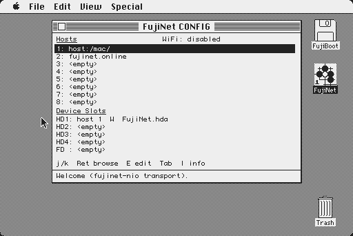
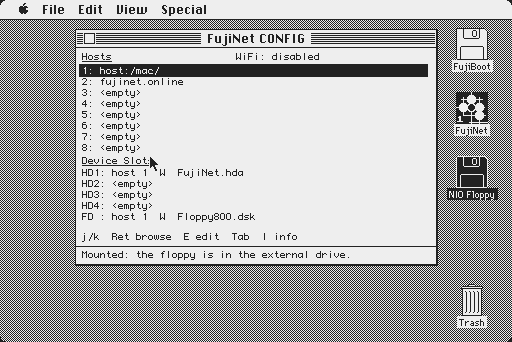

# FujiNet CONFIG desk accessory (fujinet-nio)

FujiNet CONFIG as a classic Mac **desk accessory** (`DRVR`), opened from the
Apple menu. It talks to **fujinet-nio** through the floppy port: every call
is a FujiBus packet in the HD20 mailbox blocks (fujinet-nio-lib, target
`mac68k`). It needs no driver or INIT.

The UI and the DA glue come from `~/code/fujinet-mac-da` (commit d029216):
`da_main.c`, `ui.c/h`, `fuji.h`, `fuji_typedefs_io.h`, `constants.h`,
`app_main.c`. Each file's header records its origin. `fuji_nio.c` is new. It
implements the same `fuji_*` contract on NIO services.




## How CONFIG maps onto NIO

NIO's FujiDevice has none of the classic CONFIG commands (0xF4 host slots,
0xF7 open directory, and so on), so each part maps onto an NIO service:

| CONFIG | NIO |
| --- | --- |
| 8 host slots | AppStore (0xF1), namespace `mac-config`, key `hosts`: 8 x 32 bytes. If nothing is saved, the list is built from the filesystems that answer ListDirectory (`host:/mac/`, `flash:/`, `sd0:/`), then the TNFS servers of mounted images (such as NIO's boot disk), then `fujinet.online`. It is saved to the AppStore the first time a host is edited (E). |
| host entry | An NIO URI base (`host:/mac/`, `sd0:/games/`, `tnfs://server/path/`). A bare name means TNFS (`tnfs://name/`), and `SD` means `sd0:/`. |
| open/seek/read/close directory | FileService (0xFE) ListDirectory (0x02), compact and sorted. The whole directory is read at open (up to 200 entries, 6 KB of names), cached by URI and paged locally. The end is the in-band 0x7F marker. Dot files are hidden. |
| device slots | DiskService units 1-4 are the HD20s (HD1-HD4) and unit 5 is the 800K floppy (FD). Info (0x05) gives the state and ListMounts (0x0D) gives each unit's image URI. The host column is the host whose URI prefixes the image, or `boot` for NIO's config boot mount. |
| mount | Picking a slot mounts at once: `fn_disk_mount(unit, uri, readonly, RAW, 512)`. The default mode is **read/write**, because the Finder refuses a locked disk that has no Desktop file. R/W on a mounted slot remounts it in the other mode. |
| eject | FD: `UnmountVol` + `Eject` on drive 2, like the Finder. The Mac's eject reaches NIO, which unmounts the slot and forgets it. HD1-4: `fn_disk_unmount`. |
| adapter info, WiFi | WifiService (`fn_wifi_get_status`/`get_config`): SSID, IP, gateway, netmask, DNS, BSSID. The MAC address is not available ("n/a"). |
| no FujiNet | `fn_init()` runs once. If it fails, the window opens and says "No FujiNet found on the floppy port". |

Not implemented (returns false): WiFi scan and set, new disk, copy file, and
boot config.

## Build

```sh
export PATH=$HOME/code/Retro68-build/toolchain/bin:$PATH
(cd ../../../workspace/repos/fujinet-nio-lib && make mac68k)
cmake -B build -DCMAKE_TOOLCHAIN_FILE=$HOME/code/Retro68-build/toolchain/m68k-apple-macos/cmake/retro68.toolchain.cmake
cmake --build build
```

This builds two things:
* `build/FujiConfigNIO.flt`: the DA code, 65 KB.
* `build/FujiConfigNIOApp.{bin,dsk}`: the same UI as an application, for
  testing.

The DA keeps the fujinet-mac-da rules:
* the entry glue is pc-relative;
* `da_main.c` is built without `-ffunction-sections`;
* `RETRO68_RELOCATE()` runs on every entry;
* JIODone is used only for queued calls.

Retro68's relocator allocates the 23 KB of globals (the library's 8 KB
mailbox buffer, the directory cache) with `NewPtrClear` in the heap the DA
was loaded into. The DA's own buffers are static and word-aligned, so the
host application's stack is not needed for them.

## Install

```sh
mac/tools/make-config-floppy.sh     # run/boot608.dsk -> run/boot608-config.dsk
```

The script copies the System file out of the floppy (MacBinary, through
hfsutils). `mac/tools/install_da.py` then adds the DA to it as `DRVR 21`
"FujiNet CONFIG" and removes the older fujinet-mac-da `FujiConfig` DA. The
script then writes the System file back. `install_da.py` refuses to overwrite
a different DA that has the same ID.

## Test (Snow, headless)

```sh
mac/tools/config-e2e.sh
```

It resets NIO's runtime mounts to the boot HD20 and starts NIO. It boots the
floppy and opens FujiNet CONFIG. It browses `host:/mac/`, mounts
`Floppy800.dsk` in FD and ejects it. Screenshots go in
`run/config-*.png`; `mac/evidence/config-*.png` are from a verified run.

## Keys and mouse

The Plus keyboard has no arrow keys and no Esc, so there are substitutes:

| Key | Action |
| --- | --- |
| j / k | down / up |
| , and . | previous / next page |
| Delete | up a folder |
| ` | back (Esc) |
| Return | open |
| E | edit a host, or eject a device |
| R / W | mode |
| Tab | switch between the hosts and the devices |
| I | info |

A click selects a row, and a double-click opens it.

## Limits

* The HD20 slots (HD1-4) take effect when the Mac restarts, because the ROM
  looks for HD20s only at startup. Ejecting HD1 while the Mac uses it pulls
  the disk out from under the Mac, and CONFIG does not stop you.
* After an FD eject the Finder may keep a grey icon for the volume, if it
  still had files open on it. The FujiNet side is empty.
* The directory cache holds up to 200 entries per folder.
* Host edits persist only if NIO's AppStore can write. Otherwise they last
  for the session.
* In the POSIX (emulator) setup the WiFi line reads "disabled": that is
  what NIO's WifiService reports there.

## On the real Mac

`FujiNet51.hda` (the TNFS boot disk in `APPLE/68k/RW`) has the DA in its
System file. To add a second HD20:

1. Open FujiNet CONFIG from the Apple menu. Host 2 is the boot disk's TNFS
   server.
2. Browse to an image and press Return. Pick a free HD slot (HD2 is
   preselected) and press Return again.
3. Restart the Mac. The ROM finds DCD units only at startup, so the new disk
   appears after the restart. NIO keeps the mount in its runtime mounts.

To update the boot disk:
* Power the Mac off. The ESP32 can also be held in reset.
* Take the image with `tools/tnfs_get.py`.
* Install the DA with `tools/install_da.py`.
* Put it back with `tools/tnfs_put.py`. `--base <the copy you took>` sends
  only the changed blocks.
